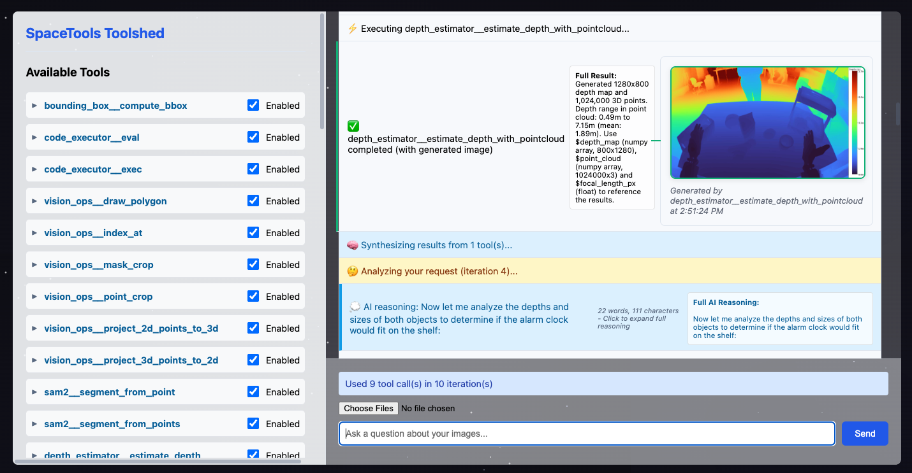
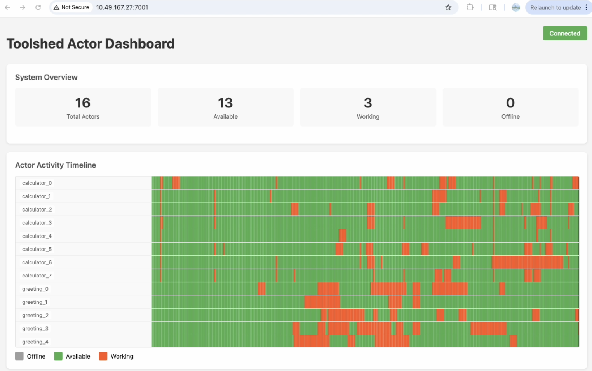

# SpaceTools-Toolshed: A Distributed Toolkit with Vision Tools for Visual Agents


SpaceTools provides **Toolshed**, a distributed framework for hosting and replicating tools such as neural network models, VLMs, VLAs in a Ray cluster, and making them available for inference or reinforcement learning workflows. SpaceTools also ships a collection of ready-to-use vision and spatial reasoning tools built on top of Toolshed.

## Table of Contents

- [Prerequisites](#prerequisites)
- [Environment \& Installation](#environment--installation)
- [Quick Start: Agent Web UI](#quick-start-agent-web-ui)
- [Launching Toolshed in Python](#launching-toolshed-in-python)
- [Toolshed Dashboard](#toolshed-dashboard)
- [🤖 Agentic Workflow](#-agentic-workflow)
  - [Simple Agent Examples](#simple-agent-examples)
  - [Agent Configuration](#agent-configuration)
- [Direct Tool Usage in Python](#direct-tool-usage-in-python)
- [Code Execution with Tool Access](#code-execution-with-tool-access)
- [Multinode Deployment](#multinode-deployment)
- [Toolshed CLI](#toolshed-cli)
- [Creating New Tools](#creating-new-tools)
- [Examples](#examples)

**Key features of Toolshed:**
- **Ray-based Architecture**: Scaling across multiple heterogeneous machines
- **Load Balancing**: Host multiple tool instances with automatic request routing
- **Queue Management**: Automatic queuing when all actors are busy
- **Environment Isolation**: Each tool has a dedicated Python environment with its own dependencies
- **Schema Generation**: Converting tool docstrings to JSON schemas for interfacing with LLM frameworks
- **Code Execution Interface**: A Pythonic interface to the full toolkit, allowing tools to be used in generated code

**Included tools** (with the ability to add your own):

**Core Tools:**
- **Code Executor**: Execute Python code with access to the toolkit

**Vision Tools:**
- **VLM**: Vision-Language Model using Molmo for object detection and image Q&A (requires GPU)
- **RoboRefer**: Vision-Language Model using RoboRefer checkpoint for visual grounding and pointing (requires GPU)
- **Depth Estimator**: Monocular depth estimation and 3D point cloud generation using ml-depth-pro (requires GPU)
- **SAM2 Segmentation**: Instance segmentation using SAM-2 (requires GPU)
- **Vision Ops**: Computer vision operations for basic image and 3D vision manipulation
- **Visual IO**: Show images from variables to the LLM, or store images as variables for later use

**3D & Spatial Tools:**
- **Bounding Box**: Compute oriented bounding boxes for masked point clouds
- **Grasp Generator**: Generate grasps using GraspGen and project them into RGB images (requires GPU)

**Robot Integration Tools:**
- **Robot**: Control a robot system via HTTP API

## Prerequisites

Before installing SpaceTools, ensure you have the following:

| Requirement | Details |
|-------------|---------|
| **OS** | Linux (tested on Ubuntu 20.04/22.04) |
| **Python** | 3.11 |
| **Conda** | Miniconda or Anaconda for environment management |
| **CUDA** | 11.8+ (required for GPU-accelerated vision tools) |
| **GPU** | NVIDIA GPU with >=40 GB VRAM recommended for vision tools |
| **RAM** | ≥32 GB recommended |
| **Disk** | ~30 GB free for model checkpoints (downloaded on first launch) |

> 💡 CPU-only tools (calculator, greeting, code executor, vision ops) work without a GPU. You can try the minimal examples without any GPU.

## Environment & Installation

### Overview

Toolshed uses **separate conda environments** for different vision tools because their dependencies are often incompatible. The key requirement is that **Python and Ray versions must match exactly** across all environments, and numpy/PIL major versions must match only for tools that send numpy/PIL data as inputs/outputs of a tool. We provide scripts to easily create matching environments and install tool dependencies.

### Setup Instructions

#### Step 1: Base Environment Setup

```bash
conda create -n toolshed python==3.11 -y
conda activate toolshed
cd SpaceTools
pip install -e .
```

> 💡 If you want to try Toolshed without installing vision tools, you can skip to [Quick Start: Agent Web UI](#quick-start-agent-web-ui) and run the minimal config. All minimal/non-vision examples should already work.

#### Step 2: Vision Tool Environments

Follow these commands to install all SpaceTools tools in separate conda environments with their expected names. Some commands will ask questions about download locations.
The syntax for the commands is `source install_tools/setup_tool_env.sh conda_env_name tool_name`

```bash
# Make sure you're in the base environment
conda activate toolshed

# One of two pointing tools:
# Molmo VLM pointing tool (redundant w.r.t RoboRefer)
source install_tools/setup_tool_env.sh tool_vlm vlm

# RoboRefer pointing tool (better, but requires cloning a fork of RoboRefer and takes longer to install)
# Will prompt for checkpoint location
source install_tools/setup_tool_env.sh tool_roborefer roborefer

# Depth Estimator
# will prompt for checkpoint location
source install_tools/setup_tool_env.sh tool_depth depth

# SAM2 Segmentation
source install_tools/setup_tool_env.sh tool_sam2 sam2

# Bounding Box tool
source install_tools/setup_tool_env.sh tool_bbox bbox

# GraspGen
# will prompt for GraspGen clone location and checkpoint location
source install_tools/setup_tool_env.sh tool_graspgen graspgen
```

> ⚠️ If you use different environment names or checkpoint locations, you will have to change them in config files and some examples as well.


Command to test that all vision tools work (will take ~10 mins on first launch while model weights are downloaded):
```bash
export OPENAI_API_KEY=...
python examples/agentic.py --provider openai --model gpt-5 --config configs/vision_full.json --image examples/media/example_image.jpg "Estimate the 3D volume of the potato"
```

### API Keys
To use external LLMs with Toolshed, set up the corresponding API keys:

```bash
export OPENAI_API_KEY=...
export ANTHROPIC_API_KEY=...
```


## Quick Start: Agent Web UI

The web interface exposes the toolshed agentic workflow, which connects tools with existing LLMs/VLMs, e.g. Anthropic, OpenAI, or your own models hosted with SGLang.



Minimal demo: launch Web UI with only calculator and greeting tools:
```bash
python toolshed/web_ui.py --config configs/minimal.json
```

Full vision demo: Launch Web UI with all vision tools using RoboRefer for pointing:
```bash
python toolshed/web_ui.py --config configs/vision_full.json
```
or using Molmo for pointing:
```bash
python toolshed/web_ui.py --config configs/vision_full_molmo.json
```
> ⏰ These will take some time to launch, longer on the first launch while model weights are downloaded.

Running the web ui with viewers for saved conversations enabled:
```bash
bash toolshed/scripts/serve.sh
```

Running the web ui with your own fine-tuned models with sglang:

```bash
bash toolshed/scripts/serve_sglang.sh
```


## Launching Toolshed in Python

Use the `start_toolkit` function to start toolshed:

examples/minimal_start_tools.py
```python
from toolshed import start_toolkit
from time import sleep

# Configure and start the toolkit
tool_configs = {
    "greeting": {"num_actors": 2, "resources": {"num_cpus": 1, "num_gpus": 0}},
    "calculator": {"num_actors": 2, "resources": {"num_cpus": 1, "num_gpus": 0}}
}
actor_handle = start_toolkit(tool_configs)

while True:
    # Sleep forever to keep actor_handle alive.
    sleep(1)
```

You can do this in a separate process (like shown above), or in the same process where you call your tools.

`tool_configs` is the only required argument, the config format follows the example:

```python
tool_configs = {
    "tool_name": {
        "num_actors": 2,          # Number of tool instances to host
        "conda_env": None,        # Conda environment (optional)
        "resources": {            # Resource requirements for each instance
            "num_cpus": 1,
            "num_gpus": 0
        },
        "args": {                 # Tool-specific constructor arguments (optional)
            "param1": "value1",
            "param2": "value2"
        }
    }
}
```

The `start_toolkit` function supports the following additional arguments:
- **`tool_configs`** (required): Dictionary mapping tool names to their configurations
- **`router_name`**: Name for the router actor (default: `"toolshed_router"`)
- **`namespace`**: Ray namespace for cluster-wide discovery (default: `"toolshed"`)
- **`ray_address`**: Ray cluster address to connect to (default: `None`, uses current Ray runtime or starts one if none are found)
- **`detached`**: Run in detached mode - actors persist after script exits (default: `False`)
- **`dashboard`**: Launch the Toolshed dashboard (default: `False`)
- **`dashboard_port`**: Port for dashboard server (default: `7001`)
- **`placement_group`**: Optional Ray placement group for resource management
- **`placement_group_size`**: Size for automatic placement group creation (int or `"auto"`). Pass "8" to ensure that all tools occupy one node with 8 gpus (default: `"auto"`)

> **⚠️ Important**: It is recommended to use `detached=False`, but maintain a reference to the actor handle returned by `start_toolkit`. Once the handle gets garbage collected, the entire toolkit including all tools will get shut down and cleaned up nicely.

## Toolshed Dashboard

The toolshed dashboard shows a timeline visualization of tool states (available, starting, running). Sound effects included, so you can listen to your tool orchestra. If you started toolshed with dashboard=True, it runs by default on port 7001.



## 🤖 Agentic Workflow

The `toolshed.agent` module implements the agentic workflow: sending messages to the LLM, executing tool calls, and returning results. It supports different LLMs (OpenAI, Anthropic, Bedrock, SGLang) via provider wrappers.

It is easy to make agents that solve problems using tools:

```python
from toolshed import start_toolkit, get_toolkit
from toolshed.agent import create_tool_agent

# Start toolkit and create agent
tool_configs = {"calculator": {"resources": {"num_cpus": 1, "num_gpus": 0}}}
handle = start_toolkit(tool_configs)
toolkit = get_toolkit()
agent = create_tool_agent(toolkit, provider="openai", model="gpt-4o")

# Create a session and send a message
session = agent.create_session("my_session")
session.add_system_message("You are a helpful assistant that uses tools to solve problems.")  # Optional system prompt
session.add_user_message("What is 5 factorial?", images=[])  # images optional

# Get response (handles tool calls automatically)
response = agent.get_response("my_session")
print(response["response"])
```

The above will block until the agent provides a final answer. For real-time progress updates, use `get_response_async` passing a step callback:

```python
async def handle_step(step):
    print(f"{step['type']}: {step.get('status', '')}")

response = await agent.get_response_async(session_id, step_callback=handle_step)
```

The agent will work until it has produced the final answer, calling the step callback on every new event.

**Step types emitted during execution:**

| Step Type | Description |
|-----------|-------------|
| `synthesizing` | A signal that the LLM is being called |
| `reasoning` | LLM responded with text |
| `tool_decision` | Summary of tools to be called in this step |
| `tool_executing` | Tool execution started |
| `tool_result` | Tool execution completed |
| `complete` | Final response |

Each step type is a dictionary but has different keys. Common keys include `type`, `iteration`, `status`, and `timestamp`. See `toolshed/agent_step_types.py` for the complete schema of each step type.

### Simple Agent Examples

See `examples/agentic.py` for a complete example of using the agent. You can try running the examples below:

Simple text-only example with calculator and greeting tools:
```bash
# Claude via Bedrock
python examples/agentic.py --provider bedrock --model us.anthropic.claude-sonnet-4-5-20250929-v1:0 --config configs/minimal.json "Compute 5! and repeat it to me backwards"

# GPT-5
python examples/agentic.py --provider openai --model gpt-5 --config configs/minimal.json "Compute 5! using the calculator tool and repeat it to me backwards"
```

Example with vision tools and image input:
```bash
# Claude via Bedrock
python examples/agentic.py --provider bedrock --model us.anthropic.claude-sonnet-4-5-20250929-v1:0 --config configs/vision_full.json --image examples/media/example_image.jpg "Would the alarm clock fit on the shelf?"

# GPT-5
python examples/agentic.py --provider openai --model gpt-5 --config configs/vision_full.json --image examples/media/example_image.jpg "Would the alarm clock fit on the shelf?"
```

### Agent Configuration

**Initialization Options:**

```python
agent = create_tool_agent(
    toolkit,
    provider="openai",                    # LLM provider: "openai", "anthropic", "bedrock", "sglang"
    model="gpt-4o",                       # Model name: "gpt-5", "gpt-5-mini", "gpt-4o", etc. (provider-specific defaults if None)
    enable_variables=True,                # Enable variable storage/resolution (default: True)
    inject_variable_instructions=True,    # Auto-append variable handling prompt to system messages (default: True)
    hide_tool_images=False,               # Hide tool output images from LLM (default: False)
    keep_dots_in_tool_names=False,        # Keep dots in tool names vs convert to "__" (default: False)
    api_key="...",                        # Provider-specific client kwargs
    base_url="..."                        # e.g., for SGLang or custom endpoints
)
```

**Session Management:**

Sessions track conversation history, images, and variables:

```python
# Create session with optional initial images
session = agent.create_session("my_session", initial_images=[image1, image2])

# Add messages
session.add_system_message("You are a helpful assistant.")
session.add_user_message("What's in this image?", images=[image])

# Get response (handles tool calls automatically)
response = agent.get_response("my_session", max_iterations=5)
```

**Tool Schema Injection:**

Tool schemas are automatically generated from toolshed tools and injected into each agent behind the scenes regardless of the system prompt. The injection method differs by provider:

- **OpenAI/Anthropic/Bedrock**: Tools are passed as structured API parameters in the `tools` field. The agent calls `toolkit.export_openai_schemas()` to generate schemas, converts them to provider-specific format via `provider.format_tools()`, and includes them in the API call.
- **SGLang**: Tool schemas are formatted as text and injected into the system message (or prepended to the first user message).

**Variables:**

Tools can store outputs as variables that persist across tool calls. LLMs can reference them with `$var_name` syntax:

```python
# Tool returns: ToolResult(..., variables={"depth_map": array, "focal_length": 123.4})
# Next tool call can use: {"input": "$depth_map", "focal": "$focal_length"}
```

Variables are automatically resolved when tools are called.
Disable variable engine with `enable_variables=False`, by default it is enabled.

**System Prompts:**

The `toolshed/prompts/` directory contains reusable prompts:
- `COORDINATE_CONVENTIONS_PROMPT`: Standardized coordinate system definitions for 2D and 3D coordinates
- `VARIABLE_HANDLING_PROMPT`: Instructions for using the variable system (`$var_name` syntax)
- `SYSTEM_PROMPT`: A complete system prompt template for vision tasks (in `spatial_reasoning.py`)

You can import and use these prompts in your own code.
The `VARIABLE_HANDLING_PROMPT` is auto-injected by the agent if `inject_variable_instructions=True` (the default).

**Tool Filtering:**

Control which of the running tools are exposed to the LLM agent:
```python
# Filter to only vision tools
agent.set_tool_filter(lambda tool: "vision" in tool["function"]["name"].lower())
# Disable filtering (show all tools)
agent.set_tool_filter(None)
```

**LLM Provider Options:**

Pass provider-specific parameters via `**kwargs` or `client_kwargs`. See modules in `toolshed/integration/providers` for the available options. E.g:
```python
# Disable thinkin on Claude via Bedrock provider
response = agent.get_response("session", thinking_mode="false")
# SGLang custom endpoint
agent = create_tool_agent(toolkit, provider="sglang", base_url="http://localhost:30000/v1")
```

## Direct Tool Usage in Python

You can use tools directly and build your own agent or tool pipelines. Tools can be called programmatically via the toolkit client.

E.g.: `examples/minimal_call_running_tools.py`
```python
from toolshed import get_toolkit

# Retrieve the toolkit client - a class that provides access to the tools
toolkit = get_toolkit()

# Print available tools:
print(f"Available tools: {toolkit.get_available_tools()}")

# Call a tool via the pythonic interface
result = toolkit.calculator.add(4, 5)

print(f"Tool result value: {result.value}")
print(f"Tool result text: {result.text}")
print(f"Tool result images: {result.image}")
print(f"Tool result variables: {result.variables}")

# Call a tool via function interface
result = toolkit.call_tool("calculator", "add", 4, 5)
result = toolkit.call_tool("calculator", "add", a=4, b=5)

# Access the documentation of the running tools:
docstring = toolkit.get_documentation()

# Access the tool schemas in OpenAI format:
json_schemas = toolkit.export_openai_schemas()
```

## Code Execution with Tool Access

#### Code Executor as a Tool
The code executor tool allows agents access to the code executor. You can equip it by adding it to your tool config:
```python
{
  "code_executor": {
    "num_actors": 1,
    "resources": {"num_cpus": 1, "num_gpus": 0},
    "conda_env": "toolshed",
    "timeout": 600
  }
}
```

#### Manual Code Execution in Python
The `CodeExecutor` class provides a way to run Python code with access to the **full toolkit**:

```python
from toolshed import CodeExecutor

# Create a code executor
executor = CodeExecutor()

# Generate documentation to tell the LLM about available tools:
docs = executor.get_toolkit().get_documentation()

# Execute code with toolkit access
result, stdout, stderr = executor.exec("toolkit.greeting.greet('World')")
print(f"Result: {result}")

# Execute more complex code
code = """
# Use multiple tools
name = "Alice"
greeting = toolkit.greeting.greet(name)
sum_result = toolkit.calculator.add(10, 5)

# The result variable will be returned
result = {
    'greeting': greeting,
    'sum': sum_result
}
"""

result, stdout, stderr = executor.exec(code)
print(f"Complex result: {result}")
```

The code execution context includes:
- All toolkit tools available as `toolkit.tool_name.method_name()`
- Common imports: `json`, `time`, `math`, `datetime`, `random`, `re`
- NumPy as `np` (if available)
- Standard built-ins: `print`, `len`, `range`, etc.

> **⚠️ Important**: This code executor is not sandboxed! Be extremely careful when using it. 

## Multinode Deployment
When starting toolshed, ray will look for a locally running ray cluster and connect to it. If none are found, it will start a cluster that spans one machine and uses all its CPU and GPU resources.

If you wish to run tools across multiple nodes or computers, you can manually bring up a ray cluster using `ray start` commands.

An example script that does this on SLURM:
```bash
sbatch --nnodes 2 -A your_ppp examples/slurm_ray_cluster_launch.sh
```

## Toolshed CLI

Toolshed provides two CLI commands:
- **`toolshed-launch`**: Launch the toolkit with tools configured via JSON
- **`toolshed-export-schemas`**: Export OpenAI-compatible tool schemas from running toolkit

### Launching Toolshed

Launch toolshed with a JSON config file and dashboard enabled:

```bash
# With dashboard visualization and custom port
toolshed-launch --config configs/vision_full.json --dashboard --dashboard-port 8080

# Custom namespace and router name to allow more than one instance on a single Ray cluster
toolshed-launch --config configs/minimal.json --namespace my_namespace --router-name my_router
```

### Exporting Tool Schemas

Export schemas from a running toolkit for use in RL training or LLM frameworks:

```bash
# Basic export
toolshed-export-schemas -o tools.yaml

# Include code executor tool
toolshed-export-schemas -o tools.yaml --include-code-executor

# With tracing configuration for Weave
toolshed-export-schemas -o tools.yaml \
  --trace-project my_project \
  --trace-experiment exp1

# Custom router name/namespace (must match what was used in toolshed-launch)
toolshed-export-schemas -o tools.yaml \
  --router-name my_router \
  --namespace my_namespace
```

**Note:** If you use a custom namespace/router name with `toolshed-launch`, you must specify the same values when using `toolshed-export-schemas` or when getting the toolkit in Python code with `get_toolkit(router_name="my_router", namespace="my_namespace")`.

## Creating New Tools

### Creating a Blank Environment for New Tools

If you're developing a new tool, use the blank environment script to get a clean slate with matching Python and Ray versions:

```bash
# From base environment
conda activate toolshed

# Creates env with Python + Ray only (no toolshed, no tool deps)
source install_tools/create_tool_env.sh my_new_tool_env

# Now install what you need
pip install -e .                    # Install toolshed
pip install torch transformers      # Install your dependencies
```

### Add a new tool to toolshed project:

1. Copy `toolshed/tools/tool_template.py` to a new Python file in `toolshed/tools/`, implement the `__init__` and add any tool methods.
2. Register the tool in `toolshed/tool_manifest.py`:

```python
TOOL_MANIFEST = {
    # ... existing tools ...
    "my_tool": "toolshed.tools.my_tool:MyTool",
}
```

### Add a new tool in your own python project:
1. Copy `toolshed/tools/tool_template.py` to a new Python file in your own project, implement the `__init__` and add any tool methods.
2. Specify `import_path` in the tool config - this tells toolshed where to find your tool class:

```python
tool_configs = {
    "my_tool": {
        "import_path": "myproject.tools.my_tool:MyTool",  # module:ClassName
        "num_actors": 1,
        "resources": {"num_gpus": 1}
    }
}
```

The `import_path` must be a valid Python import path in `module.path:ClassName` format. The module must be importable from both the base environment and the tool environment (if used).

You can then use your new tool:

```python
executor = CodeExecutor()
result, stdout, stderr = executor.exec("toolkit.my_tool.do_my_thing()")
```

### New Tool Implementation Requirements:

- **Inherit from `BaseTool`**: Import from `toolshed.tools.base`
- **Implement required method**: `get_name()`
- **Write a class docstring**: The first line becomes the tool description shown to LLMs
- **Use `@tool_method` decorator**: Only decorated methods are exposed to LLMs
- **Return `ToolResult`**: Wrap return values in `ToolResult(value, text=..., image=..., variables=...)`
- **Write Google-style docstrings**: Method descriptions and parameters are automatically converted into LLM-compatible tool schemas

**Tool Results**

`ToolResult` class supports multiple output channels for rich responses:

| Field | Type | Purpose |
|-------|------|---------|
| `value` | `T` | The actual return value used in code execution |
| `text` | `str` | Text description shown to the LLM (defaults to `str(value)`) |
| `image` | `Any \| List[Any]` | Image(s) to display inline in the LLM conversation |
| `variables` | `Dict[str, Any]` | Variables to store in the execution context for later use |
| `is_error` | `bool` | Whether this result represents an error condition (default: `False`) |

**Conditional documentation syntax:**

The docstrings may include conditional text blocks that may be present/absent depending on how the tool is launched.
- `[[if:text]]...[[/if:text]]` — Included when text output is enabled
- `[[if:image]]...[[/if:image]]` — Included when image output is enabled  
- `[[if:vars]]...[[/if:vars]]` — Included when variable output is enabled

These blocks are processed when generating documentation, so the LLM only sees descriptions relevant to the outputs it will actually receive.


## Examples

The `examples/` directory contains various usage examples. They have default values for arguments, so should work if called with no arguments. Their outputs will be saved in `outputs/` directory.

| Example | Description |
|---------|-------------|
| **Agentic Workflow** | |
| `examples/agentic.py` | LLM integration with tools, step callbacks, and optional image input |
| **Minimal (no vision tools)** | |
| `examples/minimal_start_tools.py` | Starting the toolkit with basic tools |
| `examples/minimal_call_running_tools.py` | Calling tools from a running toolkit |
| `examples/code_executor_usage.py` | CodeExecutor usage for executing Python code that calls tools |
| `examples/distributed_usage.py` | Multiple processes simultaneously contending for limited tools |
| **Multi-Tool Vision Pipelines** | |
| `examples/grasp_demo.py` | Full RoboRefer → SAM → Depth → GraspGen pipeline (validates vision tool setup) |
| `examples/visual_multi_tool_demo.py` | VLM → SAM2 → Depth pipeline to answer "How far is the object?" |
| `examples/visual_reasoning_scaling_demo.py` | Multi-GPU parallel processing: detect, segment, and estimate depth for multiple objects |
| **Individual Tools** | |
| `examples/tool_usage_*.py` | Per-tool usage demos to verify individual tool and environment setup |
| **Advanced** | |
| `examples/annotation/` | Multi-agent concurrent annotation pipeline: processes multiple images in parallel using concurrent agents that share toolshed tools, finds 3D volumes of objects, and saves annotations in JSON format. Uses roborefer, depth estimator, SAM2, bounding box tools, and a custom `save_data` tool. Run with `python examples/annotation/agentic_annotation_pipeline.py --num-images 4`. Supports launching toolshed separately for faster iteration (see `launch_toolshed_with_custom_tool.py`). |

---

## 📝 Citation

```bibtex
@misc{chen2025spacetoolstoolaugmentedspatialreasoning,
    title={SpaceTools: Tool-Augmented Spatial Reasoning via Double Interactive RL}, 
    author={Siyi Chen and Mikaela Angelina Uy and Chan Hee Song and Faisal Ladhak and Adithyavairavan Murali and Qing Qu and Stan Birchfield and Valts Blukis and Jonathan Tremblay},
    year={2025},
    eprint={2512.04069},
    archivePrefix={arXiv},
    primaryClass={cs.CV},
    url={https://arxiv.org/abs/2512.04069}
}
```
